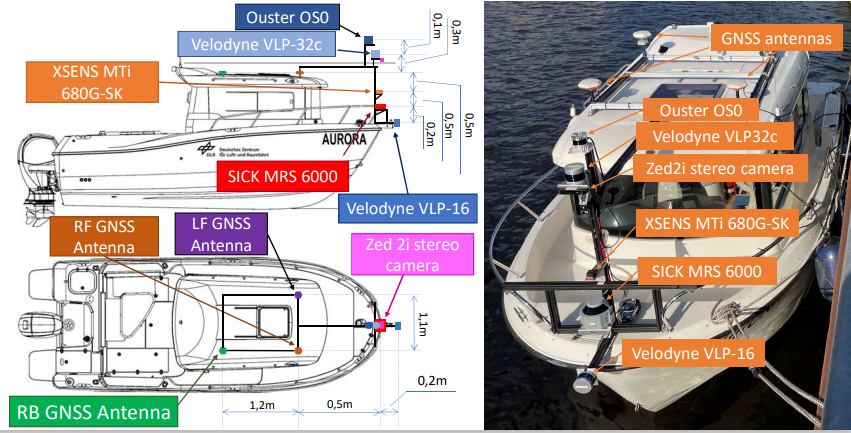
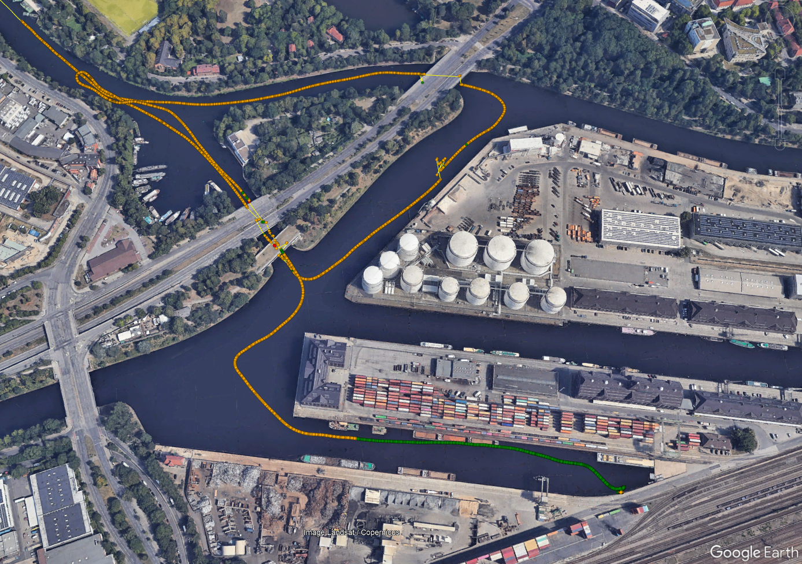
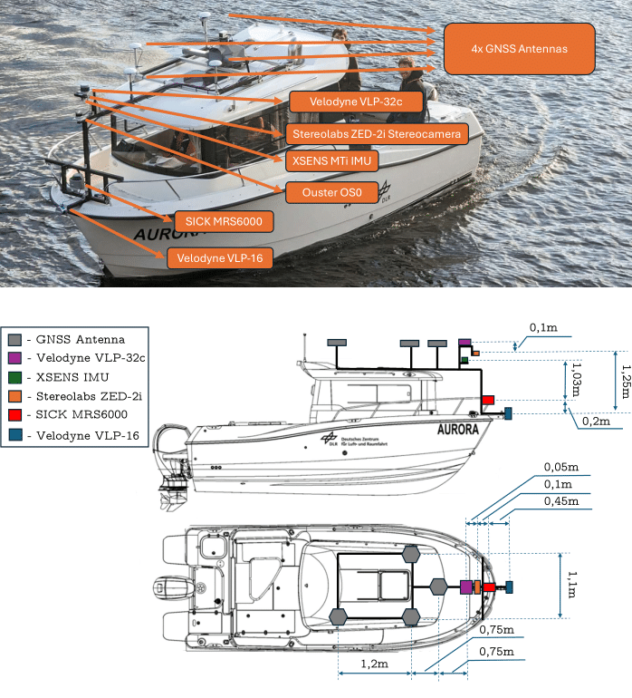
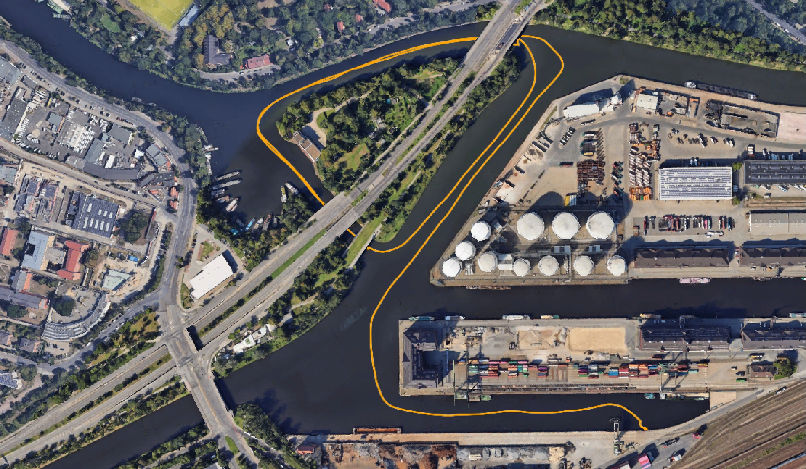

# AuroraDataset
A comprehensive Sensor Data Collection for Mapping and Localization in Inland Waterway Scenarios

## Abstract

With the volume of freight traffic increasing over the past few years, road- and rail-borne transportation tend to reach their capacity limits. Inland waterway transport (IWT) constitutes an appealing alternative to land-based transportation. Being a mode of carriage with a long history, IWT offers the advantages of high safety, low energy consumption and cost- efficiency. With the currently used large inland vessels and comparably long transportation time, IWT is most suitable for the transportation of bulky and heavy freight. In addition to the efficiency of mass transportation, the reduced effect on habitat damage of inland waterways emphasises the environmental safety of this mode of transport. To expand the operational capacity of Inland Waterway Transport (IWT), it is imperative to guarantee the safety of its associated infrastucture. One contribution to this goal, is to ensure accurate and well updated chart data. In this context, mapping and localization technologies becomes essential. Unfortunately, current open-source datasets either not address this challenge or do not provide enough sensor data. With the purpose to fix this, we present the AuroraDataset: a collection of sensory data recorded in Indland Waterway Scenarios, specially designed to output HD mapping and localization solutions. The dataset counts currently with 1 trajectory around Berlin, featuring a wide array of scenarios. It encompasses various scenarios deliberately designed to introduce diverse challenges, including navigating around islands, passing under multiple bridges, and maneuvering through sinuous curves in waterways. This dataset has been meticulously curated to provide researchers and practitioners with a robust resource that faithfully mirrors the complexity and diversity of real-world IWT environments. It comprises data from three distinct LiDAR sensors, a stereocamera, an IMU (Inertial Measurement Unit), and three GNSS (Global Navigation Satellite System) antennas, ensuring a rich and multifaceted source of information for a wide range of applications.

Keywords: HD mapping, localization, GNSS, Berlin

### Contact Authors:
- [Alonso Llorente](https://www.researchgate.net/profile/Alonso-Llorente)
- [Daniel Medina](https://scholar.google.com/citations?user=8Yd99BcAAAAJ&hl=es&oi=ao)
- [Lukas Hösch](https://linkedin.com/in/lukas-hösch-ab8771241)
- [Iulian Filip](https://linkedin.com/in/iulianfilip)

_All authors belong to the [Nautical Systems](https://www.dlr.de/kn/desktopdefault.aspx/tabid-2204/admin-1/) department from the [Insitute of Communication and Navigation](https://www.dlr.de/kn/desktopdefault.aspx/tabid-17684/) at the German Aerospace Center ([DLR](https://www.dlr.de/de))_
### Related papers:
- Hösch Lukas, Alonso Llorente, Xiangdong An, Juan Pedro Llerena and Daniel Medina, High Definition Mapping for Inland Waterways: Techniques, Challenges and Prospects, ITSC 2023, Bilbao, Spain. [see paper](https://github.com/alonsollorente/AuroraDataset/blob/main/papers/2023_itsc_mapping_inlandwaterways.pdf)

## 1. BERLIN_2023_07
### 1.1 Sensor setup
The data collection platform used for the BERLIN_2023_07, is equipped with the following sensors:
- [Velodyne VLP-32c LiDAR](https://icave2.cse.buffalo.edu/resources/sensor-modeling/VLP32CManual.pdf): 200m measurement range, 360º HFOV, 40º VFOV, 10Hz scanning rate
- [Velodyne VLP-16 LiDAR](https://velodynelidar.com/wp-content/uploads/2019/12/63-9243-Rev-E-VLP-16-User-Manual.pdf): 100m measurement range, 360º HFOV, 30º VFOV, 10 Hz scanning rate
- [SICK MRS6000](https://www.sick.com/my/en/lidar-sensors/3d-lidar-sensors/mrs6000/c/g448151) LiDAR: 200m measurement range, 120º HFOV, 15º VFOV, 10Hz scanning rate
- [XSENS MTi 680G-SK IMU](https://www.xsens.com/hubfs/Downloads/Leaflets/MTi-680G.pdf): 100 Hz scanning update
- [ZED 2i Stereocamera](https://www.stereolabs.com/assets/datasheets/zed-2i-datasheet-feb2022.pdf): 2x (2208x1242) @15fps, 2x (1920x1080) @30fps, 2x (1280x720) @60fps, 2x (662x376) @100fps
- 3x GNSS antennas ([navXperience 3G+C](https://navxperience.com/?portfolio=3gc-maritime))

     

### Extrinsic parameters and ROSBAG general information
The extrinsic calibration's matrix between the different sensors with respect to the IMU, can be found via [Extrinsic Parameters](https://github.com/alonsollorente/AuroraDataset/blob/main/calibration_aurora/calibration_aurora.txt).

- Recorded topics:
  - GNSS data (nav_msgs/Odometry): ```/gnss_pose```
  - VLP-32c (sensor_msgs/PointCloud2): ```/VLP32/velodyne_points```
  - VLP-16 (sensor_msgs/PointCloud2): ```/VLP16/velodyne_points```
  - SICK MRS6000 (sensor_msgs/PointCloud2): ```/cloud```
  - Zed2i Stereocamera:
     - Left camera image _(sensor_msgs/CompressedImage)_: ```/zed2i/zed_node/left/image_rect_color/compressed```
     - Right camera image _(sensor_msgs/CompressedImage)_: ```/zed2i/zed_node/right/image_rect_color/compressed```
     - Odom _(nav_msgs/Odometry)_: ```/zed2i/zed_node/odom```
     - Left camera info _(sensor_msgs/CameraInfo)_: ```/zed2i/zed_node/left/camera_info```
     - Right camear info _(sensor_msgs/CameraInfo)_: ```/zed2i/zed_node/right/camera_info```
  - IMU: ```/IMU_02/imu/data```
 
### 1.2 Dataset 1: 1689062708_BerlinData
**Brief**: The 1689062708_BerlinData dataset is recorded around the west of Berlin.

**General information**:
| Date of Recording | Start Time (UTC) | End Time (UTC) | Total Size | Sensors | Download |
| ----------------- | ----------------- | --------------- | ---------- | ------- | -------- |
| 2023-07-11        | 10:05:08 GMT+0200        | 10:31:13 GMT+0200        | 22.7 GB     | GNSS/3xLiDAR/IMU/Stereocamera       | [Download](https://forms.gle/7URude1NQdmrTdTJ9) |



## 1.3 Useful scripts
### 1.3.1 Extract GNSS path
Given the .bag file, plot the 3D GNSS path.

. Build:
```bash
  cd ~/catkin_ws/src
  git clone https://github.com/alonsollorente/AuroraDataset
  cd ../
  catkin_make
  source ~/catkin_ws/devel/setup.bash
  ```
- Use
   - gnss_plot.py
     ```
     python3 gnss_plot.py
     ```

## 2. BERLIN_2023_11
### 2.1 Sensor setup
The data collection platform used for the BERLIN_2023_11, is equipped with the following sensors:
- [Velodyne VLP-32c LiDAR](https://icave2.cse.buffalo.edu/resources/sensor-modeling/VLP32CManual.pdf): 200m measurement range, 360º HFOV, 40º VFOV, 10Hz scanning rate
- [Velodyne VLP-16 LiDAR](https://velodynelidar.com/wp-content/uploads/2019/12/63-9243-Rev-E-VLP-16-User-Manual.pdf): 100m measurement range, 360º HFOV, 30º VFOV, 10 Hz scanning rate
- [SICK MRS6000](https://www.sick.com/my/en/lidar-sensors/3d-lidar-sensors/mrs6000/c/g448151) LiDAR: 200m measurement range, 120º HFOV, 15º VFOV, 10Hz scanning rate
- [Ouster OS0](https://www.sick.com/my/en/lidar-sensors/3d-lidar-sensors/mrs6000/c/g448151) LiDAR: 200m measurement range, 120º HFOV, 15º VFOV, 10Hz scanning rate
- [XSENS MTi 680G-SK IMU](https://www.xsens.com/hubfs/Downloads/Leaflets/MTi-680G.pdf): 100 Hz scanning update
- [ZED 2i Stereocamera](https://www.stereolabs.com/assets/datasheets/zed-2i-datasheet-feb2022.pdf): 2x (2208x1242) @15fps, 2x (1920x1080) @30fps, 2x (1280x720) @60fps, 2x (662x376) @100fps
- 4x GNSS antennas ([navXperience 3G+C](https://navxperience.com/?portfolio=3gc-maritime))
     - High-budget receivers:
          - 3x [Geodetic JAVAD Triumph](https://download.javad.com/sheets/TRIUMPH-4X_Datasheet.pdf)
          - 1x [JAVAD Delta](https://download.javad.com/sheets/Delta_Overall_Datasheet.pdf)
     - Low-budget receivers:
          - 4x [uBlox M8](https://content.u-blox.com/sites/default/files/products/documents/u-blox8-M8_ReceiverDescrProtSpec_UBX-13003221.pdf)



### 2.2 Dataset 1: 231107_AURORA_BerlinData
**Brief**: The 231107_AURORA_BerlinData dataset takes a double turn around the Westhafen Island in Berlin.

- Recorded topics:
  - uBlox M8 data:
       - sensor_msgs/NavSatFix: ```/ublox_x/fix```
       - geometry_msgs/TwistWithCovarianceStamped: ```/ublox_x/fix_velocity```
  - VLP-32c (sensor_msgs/PointCloud2): ```/VLP32/velodyne_points```
  - VLP-16 (sensor_msgs/PointCloud2): ```/VLP16/velodyne_points```
  - Zed2i Stereocamera:
     - Left camera image _(sensor_msgs/CompressedImage)_: ```/zed2i/zed_node/left/image_rect_color/compressed```
     - Right camera image _(sensor_msgs/CompressedImage)_: ```/zed2i/zed_node/right/image_rect_color/compressed```
     - Left camera info _(sensor_msgs/CameraInfo)_: ```/zed2i/zed_node/left/camera_info```
     - Right camear info _(sensor_msgs/CameraInfo)_: ```/zed2i/zed_node/right/camera_info```
  - IMU: ```/IMU_01/imu/data```

**General information**:
| Date of Recording | Start Time (UTC) | End Time (UTC) | Total Size | Sensors | Download |
| ----------------- | ----------------- | --------------- | ---------- | ------- | -------- |
| 2023-11-08        | 15:35:20 GMT+0200        | 15:56:59 GMT+0200        | 14.9 GB     | 3x uBlox/2x LiDAR/x1 IMU/x1 Stereocamera       | [Download](https://forms.gle/7URude1NQdmrTdTJ9) |




